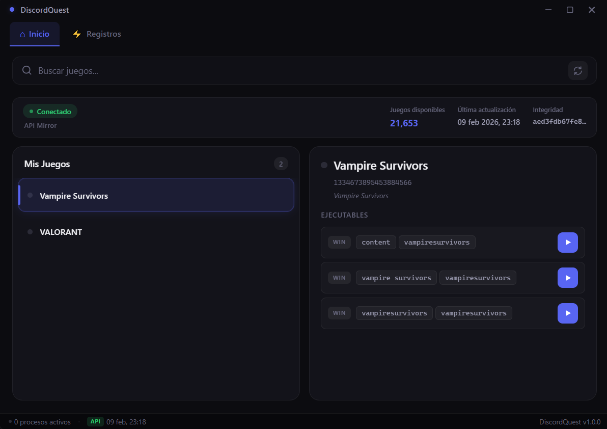

<p>
  <h1 align="center">DiscordQuest</h1>
</p>

<p align="center">
  Aplicacion de escritorio para Windows que simula actividad de juegos verificados de Discord, permitiendo completar Discord Quests sin necesidad de instalar los juegos reales.
</p>

<p align="center">
  
</p>

---

## Caracteristicas

- Simula jugar juegos verificados de Discord sin instalarlos
- Completa Discord Quests que requieren 15 minutos de juego
- Busqueda rapida entre +21,000 juegos detectables por Discord
- Lista de juegos persistente entre sesiones
- Deteccion automatica cuando el juego se cierra externamente
- Ventana fake con timer y bandeja del sistema
- Actualizacion optimista de la UI (respuesta instantanea)
- Ciclo de vida bidireccional entre la app y la ventana fake
- Terminacion graceful de procesos
- Modo Steam automatico para juegos sin ejecutable Win32 publicado por Discord
- Limpieza y restauracion automatica de los archivos temporales del modo Steam
- Modo opcional para ejecutar varias quests simultaneamente

## Como funciona

La app crea pequenos ejecutables (~250KB) que imitan los procesos que Discord busca para detectar juegos verificados. Al ejecutarlos, Discord los reconoce como si fuera el juego real y activa Rich Presence.

Los ejecutables se almacenan en una carpeta `games/` relativa al ejecutable principal:

```
DiscordQuest/
+-- DiscordQuest.exe
+-- data/
|   +-- src-win.exe
+-- games/
    +-- <app-id>/
        +-- <ruta-del-juego>/
            +-- nombre-del-juego.exe
```

> [!TIP]
> Con el tiempo estos archivos pueden acumularse. Puedes eliminar manualmente las carpetas dentro de `games/` cuando quieras.

### Juegos sin ruta ejecutable: modo Steam

Si Discord no publica un ejecutable Win32 pero si un AppID de Steam, DiscordQuest usa un flujo separado. Consulta la metadata de SteamCMD, coloca temporalmente el runner en `Steam\\steamapps\\common\\<juego>` y genera `appmanifest_<appid>.acf` con `StateFlags=1026`.

Antes de reemplazar un archivo existente crea un respaldo. Al detener el proceso, cerrar su ventana o salir de DiscordQuest, restaura los originales y elimina el runner, el manifiesto, el marcador y los respaldos temporales. Un journal local permite terminar esa limpieza en el siguiente inicio si hubo un cierre inesperado.

Steam debe estar instalado y registrado en Windows. El cliente de Steam no necesita permanecer abierto, pero se requiere conexion al iniciar para consultar SteamCMD. Este modo solo se ofrece a juegos que no pueden usar el flujo normal.

### Configuracion

El apartado **Configuracion** permite activar la ejecucion simultanea de varias quests. La opcion esta desactivada por defecto; cuando permanece apagada, iniciar un juego detiene los demas como en versiones anteriores.

La lista de juegos usa IndexedDB y se muestra desde la cache local. Por defecto solo se consulta el pequeno `meta.json` una vez al dia y la lista completa se descarga si cambia su SHA. Tambien puedes elegir comprobacion en cada inicio, semanal o exclusivamente manual.

---

## Instalacion

Descarga `DiscordQuest_x64-setup.exe` desde [Releases](../../releases), ejecutalo e instala. No requiere permisos de administrador.

> [!NOTE]
> WebView2 se instala automaticamente si no lo tienes. Viene preinstalado en Windows 11.

---

## Tech Stack

- **Rust** - Backend (Tauri v2) + Ventana fake (Win32 API)
- **Vue.js 3** - Frontend con Composition API + TypeScript
- **Fuse.js** - Busqueda difusa de juegos

---

## Desarrollo

### Requisitos

- [Rust](https://www.rust-lang.org/tools/install) y los [prerrequisitos de Tauri](https://tauri.app/start/prerequisites/)
- [Node.js](https://nodejs.org/) 20+

### Setup

```bash
npm install
npm run tauri:dev
```

### Build

```bash
npm run build:all
```

---

## Aviso legal

Esta herramienta es para fines educativos y uso personal. Respeta los terminos de servicio de Discord, los derechos de los editores de juegos y los anunciantes.

Los creadores y mantenedores de este proyecto no son responsables de danos, suspensiones de cuenta u otras consecuencias derivadas del uso de este software. **Usalo bajo tu propia responsabilidad.**

Discord es una marca registrada de Discord Inc. Se hace referencia a ella unicamente con fines descriptivos.

---

## Licencia

[MIT License](LICENSE) - Basado en trabajo de [Mark Terence Tiglao](https://github.com/markterence).

---

Desarrollado por [4ismael1](https://github.com/4ismael1)
